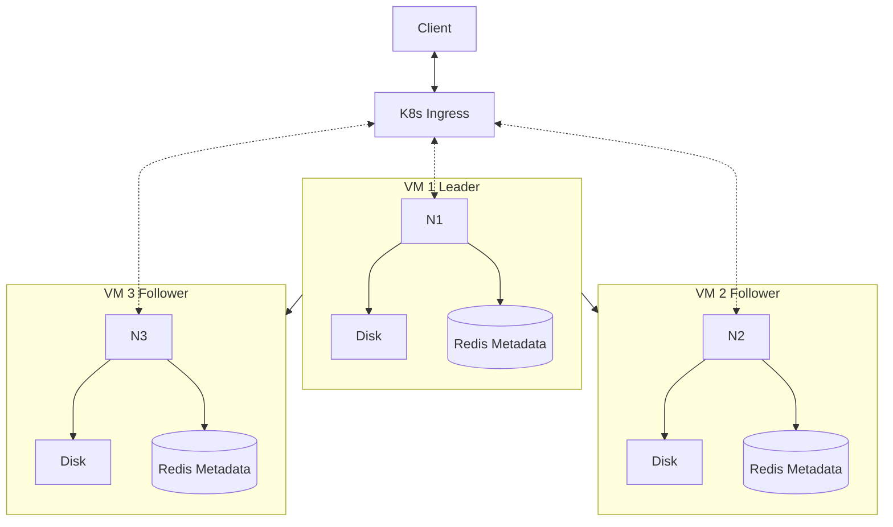

# Distributed Filesystem

## Overview

The aim of this project is to implement a distributed filesystem based on multiple nodes. In the scope of the course [Distributed Systems](https://studies.helsinki.fi/kurssit/opintojakso/otm-1b26b72f-19c4-424f-8524-e917b67a659d), the project is based on Kubernetes cluster.

## Technologies

- Python and FastAPI for the server node interface
- Key-Value store for the database inside the server node (Redis)
- Docker for virtualization
- Kubernetes to orchestrate the containers

## Messaging protocols

- The client connects to the Ingress via HTTP protocol and the load balancer communicates to the server nodes via HTTP protocol
- The server nodes communicate via message HTTP protocol with each other

## Functionalities

### Shared distribution state

- The leader node retains the current state of the database that is replicated to all other nodes. The writes are only directed to the leader server and reads are balanced across all nodes.

### Synchronization and consistency

- All server nodes have the same data eventually replicated. Client is given a success response once the data is written to the leader node, so the client doesn't have to wait the data replication.
- In case of a conflict, the leader's state of the database entries is considered as the most recent/true state of the system.
- When scaling up a new node has to copy the most recent data from the current leader server.

### Consensus

- Normally there shouldn't be conflicts, conflicts might only happen when a single server fails.
- Conflict resolution is based on the leader-follower model.
- All nodes agree that there is a single leader that the other's follow.

### Fault tolerance

- Ingress routes the client requests to the healthy servers.
- If a server node fails, a new instance can be created and the data and state copied to remain consistent.
- In case the leader node fails, a new one is elected.

## Architecture

One server node is always selected as the leader which will handle the writes and the other server nodes will act as the follower nodes, which can handle reads.

### Server nodes

- Store data to the disk using persistent volumes. Keep metadata about the files in the disk.
- Communicates with other nodes throught the HTTP interface. On write of new data to the leader node will result in the leader calling each of the follower nodes with the data to replicate across.
- Communicate to the client throught the Ingress controller.

### Ingress/load balancer node:

- Handle the client requests to the server nodes.
- Act as a gateway to access the system for the client

### Diagram

## Team members

- Riku Rauhala
- Valtteri Kantanen
- Henri Remonen
- Tuomas Huhtala
- Eero Vahteri
