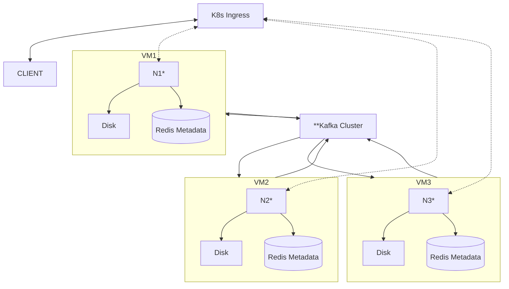

# Distributed Filesystem

## Overview

The aim of this project is to implement a distributed filesystem based on multiple nodes. In the scope of the course [Distributed Systems](https://studies.helsinki.fi/kurssit/opintojakso/otm-1b26b72f-19c4-424f-8524-e917b67a659d), the project is based on three virtual machines, but this could be scaled up easily.

## Technologies

- Apache Kafka platform to handle the communication between the nodes
- Python and FastAPI for the client interface
- Key-Value store for the database inside the server nodev (Redis)
- Docker for virtualization
- Kubernetes to orchestrate the containers (server nodes)

## Messaging protocols

- The client connects to the load balancer via HTTP protocol and the load balancer communicates to the server nodes via HTTP protocol
- The server nodes communicate via message queue with each other

## Functionalities

1. Shared distribution state
- The leader node retains the current state of the database that is replicated to all other nodes.

2. Synchronization and consistency
- All server nodes have the same data at all times replicated
- In case of a conflict, the leader's state of the database entries is considered as the most recent/true state of the system.

3. Consensus
- Conflict resolution is based on the leader-follower model.
- All nodes agree that there is a single leader that the other's follow.

4. Fault tolerance
- In case a node fails, the client can connect to another node to receive the data, as it is replicated in every node.
- If a node fails, a new instance can be created and the data and state copied to remain consistent
- In case the leader node fails, a new one is elected
## Team members

- Riku Rauhala
- Valtteri Kantanen
- Henri Remonen
- Tuomas Huhtala
- Eero Vahteri

# Architecture

The nodes of the systems are replicated with each other, and their roles are the same:

Server nodes
- Store the data
- Communicates with other nodes through Kafka cluster
- Has a HTTP interface to access the data from the load balancer
- Message queue to handle internal messaging

Ingress/load balancer node:
- Handle the load balancing
- Act as a gateway to access the system for the client

### Explanation

- *some docker image
- **replicated across all VMs, use Kafkas own redundancy solution
- Atleast once delivery
- Availability over consistency
- Conflict resolution based on timestamps which comes with the message and indicates the time received on the original server
