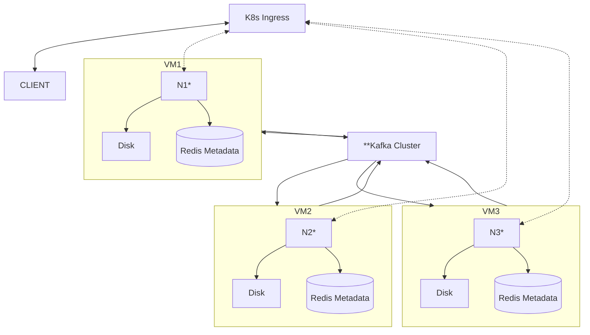

# Architecture

### Explanation

- *some docker image
- **replicated across all VMs, use Kafkas own redundancy solution
- Atleast once delivery
- Availability over consistency
- Conflict resolution based on timestamps which comes with the message and indicates the time received on the original server
