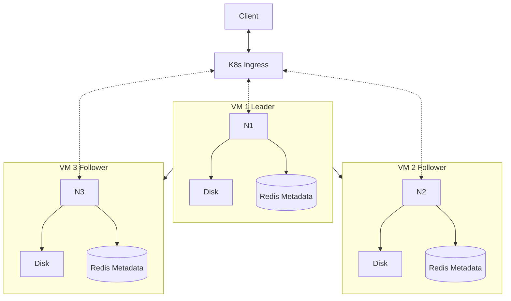

# Distributed Filesystem

## Overview

The goal of this project is to create a distributed filesystem using a multinode leader-follower architecture. The system will be deployed on a hosted OpenShift Kubernetes cluster. This project is developed as part of the course [Distributed Systems](https://studies.helsinki.fi/kurssit/opintojakso/otm-1b26b72f-19c4-424f-8524-e917b67a659d) offered by the University of Helsinki.

## Technologies

- Python and FastAPI will be used to implement the HTTP interface for the server nodes.
- Key-Value store (Redis for example) utilized within each server node for fast in-memory data access, such as metadata of stored files.
- Docker for virtualization and easy Kuberneted deployment.
- Kubernetes used to orchestrate the Docker containers, provide load balancing, and routing client requests to the appropriate server nodes.

## Messaging protocols

- The client connects to the Kubernetes Ingress via HTTP protocol and the load balancer communicates to the server nodes via HTTP protocol.
- The server nodes communicate via message HTTP protocol with each other

## Functionalities

### Shared distribution state

- The leader node retains the current state of the database that is replicated to all other nodes. The writes are only directed to the leader server and reads are balanced across all nodes.

### Synchronization and consistency

- The system follows an eventual consistency model. After a write operation is completed on the leader, the data is asynchronously replicated to the followers.
- Clients receive a success response once the leader node records the data, without waiting for the replication to complete, reducing latency.
- In case of a conflict, the leader's state of the database entries is considered as the most recent/true state of the system.
- When scaling up a new node has to copy the most recent data from the current leader server.

### Consensus

- Normally there shouldn't be conflicts, conflicts might only happen when a single server fails.
- Conflict resolution is based on the leader-follower model.
- All nodes agree that there is a single leader that the other's follow.

### Fault tolerance

- Ingress routes the client requests to the healthy servers.
- If a server node fails, a new instance can be created and the data and state copied to remain consistent.
- In case the leader node fails, a new one is elected using a leader election algorithm.

## Architecture

One server node is always selected as the leader which will handle the writes and the other server nodes will act as the follower nodes, which each can handle reads.

### Server nodes

Leader node:

- One server node is always designated as the leader. It handles all write operations and might handle read operations along with followers.
- Leader is responsible for replicating the data to follower nodes for consistency.
- Store data to the disk using persistent volumes. Keep metadata about the files in the disk.
- Communicate to the client throught the Ingress controller.

Follower nodes:

- Store data to the disk using persistent volumes. Keep metadata about the files in the disk.
- Handles read operations from client using a HTTP interface.

### Ingress/load balancer node:

- Manage client requests. It acts as a gateway, routing incoming HTTP requests from clients to the appropriate server nodes (leader or followers).
- Distributes client requests, prioritizing reads across follower nodes and writes to the leader node

### Diagram

## Team members

- Riku Rauhala
- Valtteri Kantanen
- Henri Remonen
- Tuomas Huhtala
- Eero Vahteri

## Challenges and Considerations

- We are still thinking should the client be given success on write when majority (>50%) of the nodes acknowledge the write locally.
- How to select the leader among the server nodes, look in to RAFT or something similar.
- If the decide on using RAFT, we probably have to use RPC for communicating? Is HTTP still feasible?
- How does the Ingress controller know which server node is the current leader? Because we want to route the POST requests to this leader node and GET requests to any node.
- How do we handle the offline server nodes? We probably want some kind of heartbeat algorithm. Can the Ingress controller somehow use deployment livenessprobes to check service status?