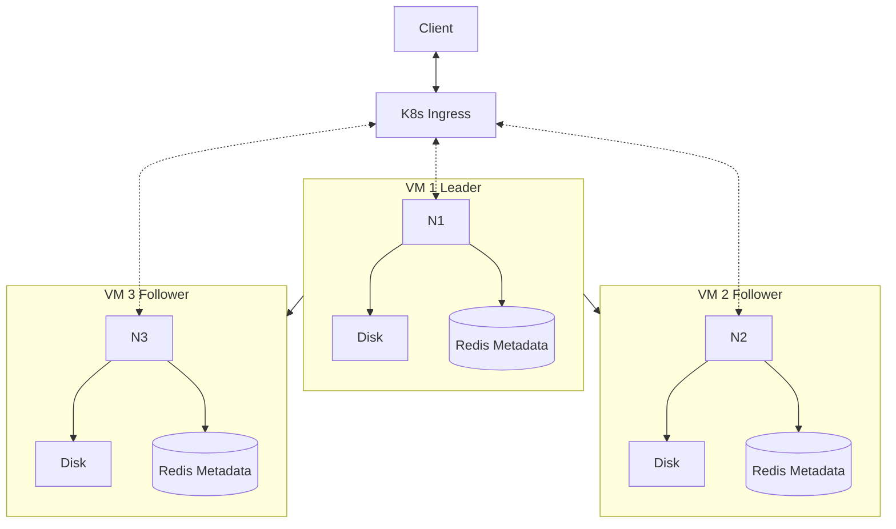

# Distributed File System

## Instructions

### How to install

```bash
# Create virtual environment
$ python3 -m venv .venv

# Activate virtual environment
$ source .venv/bin/activate

# Install dependencies
$ pip install -r requirements.txt
```

### How to run

#### With Docker

```bash
# Create storage directory if it doesn't exist
$ mkdir storage
# Starts the application with three replicas in ports 8000, 8001, and 8002
$ docker compose up --scale app=3
```

#### Without Docker

```bash
# Run in development mode
$ fastapi dev src/main.py
```

### Code quality

```bash
# Lint
$ pylint src

# Format
$ black src
```

## Overview

The goal of this project is to create a distributed file system using a multinode leader-follower architecture. The system will be deployed on a hosted OpenShift Kubernetes cluster. This project is developed as part of the course [Distributed Systems](https://studies.helsinki.fi/kurssit/opintojakso/otm-1b26b72f-19c4-424f-8524-e917b67a659d) offered by the University of Helsinki.

## Technologies

- Python and FastAPI will be used to implement the HTTP interface for the server nodes.
- A key-value store (Redis for example) will be utilized within each server node for fast in-memory data access, such as metadata of stored files.
- Docker for virtualization and easy Kubernetes deployment.
- Kubernetes will be used to orchestrate the Docker containers, provide load balancing, and route client requests to the appropriate server nodes.

## Messaging protocols

- The client connects to the Kubernetes Ingress via the HTTP protocol, which communicates with the server nodes via HTTP.
- The server nodes communicate with each other via the HTTP protocol.

## Functionalities

### Shared distributed state

- The leader node retains the current state of the database that is replicated to all other nodes. Writes are only directed to the leader server, and reads are balanced across all nodes.

### Synchronization and consistency

- The system follows an eventual consistency model. After a write operation is completed on the leader, the data is asynchronously replicated to the followers.
- Clients receive a success response once the leader node records the data, without waiting for the replication to complete, reducing latency.
- In case of a conflict, the leader's state of the database entries is considered the most recent/true state of the system.
- When scaling up, a new node has to copy the most recent data from the current leader server.

### Consensus

- Normally, conflicts shouldn't occur; they might only happen when a single server fails.
- Conflict resolution is based on the leader-follower model.
- All nodes agree that there is a single leader that the others follow.

### Fault tolerance

- Ingress routes the client requests to the healthy servers.
- If a server node fails, a new instance can be created and the data and state copied to remain consistent.
- In case the leader node fails, a new one is elected using a leader election algorithm.

## Architecture

One server node is always selected as the leader, which will handle writes. The other server nodes will act as follower nodes, each of which can handle reads.

### Server nodes

**Leader node:**

- One server node is always designated as the leader. It handles all write operations and might handle read operations along with followers.
- The leader is responsible for replicating the data to follower nodes for consistency.
- It stores data on the disk using persistent volumes and keeps metadata about the files on the disk.
- Communicates with the client through the Ingress controller.

**Follower nodes:**

- They store data on the disk using persistent volumes and keep metadata about the files on the disk.
- They handle read operations from clients using an HTTP interface.

### Ingress/Load balancer node

- Manages client requests. It acts as a gateway, routing incoming HTTP requests from clients to the appropriate server nodes (leader or followers).
- Distributes client requests, prioritizing reads across follower nodes and writes to the leader node.

### Diagram



## Team members

- Riku Rauhala
- Valtteri Kantanen
- Henri Remonen
- Tuomas Huhtala
- Eero Vahteri

## Challenges and considerations

- We are still considering whether the client should be given success on write when majority (>50%) of the nodes acknowledge the write locally.
- How to select the leader among the server nodes; look into RAFT or something similar.
- If we decide on using RAFT, we probably have to use RPC for communicating? Is HTTP still feasible?
- How does the Ingress controller know which server node is the current leader? We want to route POST requests to this leader node and GET requests to any node.
- How do we handle offline server nodes? We probably want some kind of heartbeat algorithm. Can the Ingress controller somehow use deployment liveness probes to check service status?
